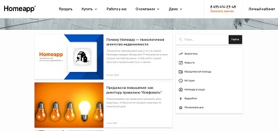

<!--
**Annnek/Annnek** is a ✨ _special_ ✨ repository because its `README.md` (this file) appears on your GitHub profile.

Here are some ideas to get you started:

- 🔭 I’m currently working on ...
- 🌱 I’m currently learning ...
- 👯 I’m looking to collaborate on ...
- 🤔 I’m looking for help with ...
- 💬 Ask me about ...
- 📫 How to reach me: ...
- 😄 Pronouns: ...
- ⚡ Fun fact: ...
-->

    
    

<h1 align="center">Hey! I'm Anna.</h1>

I'm self-motivated and passionate junior Web developer and now I'm seeking an opportunity to expand my skill set.

My previous job was in IT company where I fell in love with the widespread possibilities of modern technology. I moved from marketing to IT department. My previous experience in marketing and project management helps me understand the real needs of the business as well as the specifics of product development, key indicators, user and beneficiary expectations.

I've graduated some web-development courses and now I’m actively learning frameworks and libraries  and looking for a job or internship in IT-sector.

I will be glad to join your team!
  
---
<h3>Skills</h3>

<!--  -->

 

<h3>Education</h3>
    
<ul>
 <li><a href="https://practicum.yandex.ru/web/" target="_blank">Web development, Yandex Practicum</a> - learning now</li>
 <li><a href="https://www.udemy.com/course/the-complete-web-development-bootcamp/" target="_blank">The Complete 2022 Web Development Bootcamp (Dr.Angela Yu), Udemy</a> - learning now</li>
 <li>Responsive Web Design, FreeCodeCamp
   <ul>
     <li>

To see certificate click here

       <a href="https://www.freecodecamp.org/certification/Annnek/responsive-web-design" target="_blank">https://www.freecodecamp.org/certification/Annnek/responsive-web-design</a>
       

     </li>
   </ul> 
 </li>
 <li>JavaScript Algorithms and Data Structures Certification, FreeCodeCamp
   <ul>
     <li>

To see certificate click here

         <a href="https://www.freecodecamp.org/certification/Annnek/javascript-algorithms-and-data-structures" target="_blank">https://www.freecodecamp.org/certification/Annnek/javascript-algorithms-and-data-structures</a>
         

     </li>
   </ul> 
 </li>
</ul>
          
<h3>My projects</h3>

<table border="1">
      <tr>
        <th>Project</th>
        <th width="35%">Preview</th>
      </tr>
      <tr>
        <td>
        <h3 style="color: blue">Company's blog</h3>
          
<strong>Tools: Html/CSS, CSS-Flexbox, CSS-Variables</strong>

          
Company's blog is designed to attract and retain potential customers. My tasks:

          <ul>
            <li>Development and adaptive layout of the blog user interface;</li>
            <li>Assistance with setting up blog integration with CMS Wordpress;</li>
            <li>Content management;</li>
          </ul>          
        </td>
        <td>
          
Click preview

          
        </td>
      </tr>
      <tr>
        <td>
        <h3 style="color: blue">Feedback form</h3>
          
<strong>Tools: Html/Css, CSS-Flexbox, CSS-Variables </strong>

          
Client's personal account: an internal tool for customer retention and growth of loyalty to the company, where clients see how their property is being sold. The feedback form allows the customer to quickly report a problem or thank the company.

            
Details of this project can be read <a href="https://vc.ru/tribuna/245607-lichnyy-kabinet-klienta-kak-instrument-prodazh-kakoy-funkcional-rabotaet"> in the article on my blog in VC </a>

            
My tasks:

          <ul>
            <li>Development and adaptive layout of two html/css blocks - 'Report a problem' and 'Leave feedback'. Colleagues adapted to react;</li>
            <li>Setting up sending the entered data to the mail of the head of the sales and marketing departments;</li>
          </ul>
         </td>
        <td>
          
Click preview

          
        </td>
      </tr>
      <tr>
        <td>
        <h3 style="color: blue">Portfolio</h3>
          
<strong>Tools: Bootstrap, Html/Css, CSS-Flexbox, CSS-Variables</strong>

          
All my projects in one place. Originally created with Html/CSS, then modified with Bootstrap

            
My project has the following functions:

          <ul>
            <li>One page project with internal navigation;</li>
            <li>Adaptive layout;</li>
            <li>The project block is made with CSS-Flexbox, expands when you click Show all</li>
          </ul>
          
You can find the code <a href="https://github.com/Annnek/My-portfolio" target="_blank">here</a>. Deploy is <a href="https://annnek.github.io/My-portfolio/" target="_blank">here</a> or you can click on the image on the right.

        </td>
        <td>
          
Click preview

          
        </td>
      </tr>      
      <tr>
       <td>
        <h3 style="color: blue">Survey form</h3>
          
<strong>Tools: Bootstrap, Html/Css, CSS-Flexbox, CSS-Variables</strong>

          
Project for selecting a convenient tourist trip. Originally created with Html/CSS, then modified with Bootstrap

          
My project has the following functions: 

          <ul>
            <li>Different type of input-data – text, e-mail, number, min-max;</li>
            <li>Dropdown-elements, checkboxes, radio-button;</li>
          </ul>
          
You can find the code <a href="https://github.com/Annnek/Survey-form">here</a>. Deploy is <a href="https://annnek.github.io/Survey-form/">here</a> or you can click on the image on the right.

       </td>
       <td>
          
Click preview

          
       </td>
      </tr>
     <tr>
       <td>
        <h3 style="color: blue">Codewars tasks</h3>
          
<strong>Tools: Java Script</strong>

          
  Codewars exercises
          
       </td>
       <td>
        

Statistic is here

        
<a href="https://www.codewars.com/users/Annnek/stats?target=_blank">
          </img></a>

        

       </td>
      </tr>
  </table>

<h3>My programming Stats</h3>
      

        
 <b>click here</b> 

        

        
&nbsp;

        

      

     
<h3>Contact me 📫</h3>
    

      
      
    

