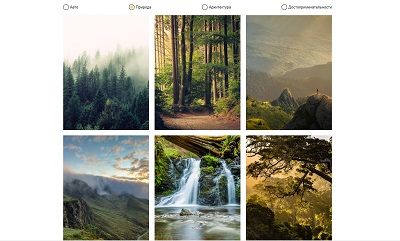

    
    
    

    
<h1 align="center">I'm Anna.</h1>

I'm self-motivated front-end developer with a background in Marketing, looking to combine my marketing expertise with technology skills.

- 🏄‍ Created and promoted IT products for B2B and B2C markets.
- ⚡ I am passionate about every stage of development, from ideation to the final product.
- 💗 Love aesthetically beautiful projects.

---

### Skills 🛠️

<!--  -->

### Programming Stats

  
  

## Education

<ul>
 <li><a href="https://practicum.yandex.ru/web/" target="_blank">Web development, Yandex Practicum</a></li>
 <li><a href="https://www.udemy.com/course/the-complete-web-development-bootcamp/" target="_blank">The Complete 2022 Web Development Bootcamp (Dr.Angela Yu), Udemy</a> - learning now</li>
 <li>Responsive Web Design, FreeCodeCamp
   <ul>
     <li>

To see certificate click here

       <a href="https://www.freecodecamp.org/certification/Annnek/responsive-web-design" target="_blank">https://www.freecodecamp.org/certification/Annnek/responsive-web-design</a>
       

     </li>
   </ul> 
 </li>
 <li>JavaScript Algorithms and Data Structures Certification, FreeCodeCamp
   <ul>
     <li>

To see certificate click here

         <a href="https://www.freecodecamp.org/certification/Annnek/javascript-algorithms-and-data-structures" target="_blank">https://www.freecodecamp.org/certification/Annnek/javascript-algorithms-and-data-structures</a>
         

     </li>
   </ul> 
 </li>
</ul>          
  
## Contact me 📫

  
  
  

<!-- <h3>My projects</h3>

<table border="1">
  <tr>
    <th>Project</th>
    <th width="35%">Preview</th>
  </tr> -->
  <!-- Company's blog -->
  <!-- <tr>
    <td>
      <h3 style="color: blue">Company's blog</h3>
      
<strong>Tools: Html/CSS, Flexbox, Variables</strong>

      
Company's blog is designed to attract and retain potential customers. My tasks:

      <ul>
        <li>Development and adaptive layout of the blog user interface;</li>
        <li>Assistance with setting up blog integration with CMS Wordpress;</li>
        <li>Setting animation when hovering over the article image and menu;</li>
        <li>Content management.</li>
      </ul>  
      
This is a working project, I haven’t saved the code.

      
You can see the result <a href="/images/blog.jpg" target="_blank">here</a> or you can click on the image on the right.
        
    </td>
    <td>
      
Click preview

      
    </td>
  </tr> -->
  <!-- Feedback form     -->
  <!-- <tr>
    <td>
      <h3 style="color: blue">Feedback form</h3>
      
<strong>Tools: Html/Css, CSS-Flexbox, CSS-Variables </strong>

      
Client's personal account: an internal tool for customer retention and growth of loyalty to the company, where clients see how their property is being sold. The feedback form allows the customer to quickly report a problem or thank the company.

      
Details of this project can be read <a href="https://vc.ru/tribuna/245607-lichnyy-kabinet-klienta-kak-instrument-prodazh-kakoy-funkcional-rabotaet"> in the article on my blog in VC </a>

      
My tasks:

      <ul>
        <li>Development and adaptive layout of two html/css blocks - 'Report a problem' and 'Leave feedback';</li>
        <li>Programming open/close modal pop-up;</li>
        <li>Setting up sending the entered data to the mail of the head of the sales and marketing departments;</li>
      </ul>
      
The functions of the personal account are available only to the clients of the company.

      
You can see the example <a href="https://homeapp.ru/profile/realty/example/view" target="_blank">here</a> or you can click on the image on the right.

    </td>
    <td>
      
Click preview

      
    </td>
  </tr> -->
<!-- E-commerce project -->
  <!-- <tr>
    <td>
      <h3 style="color: blue">E-commerce project</h3>
      
<strong>Tools: Html/Css, CSS-Flexbox, CSS-Variables, Grids</strong>

      
Beautiful project for e-commerce. Originally created with Html/CSS

      
My project has the following functions: 

      <ul>
        <li>One page project with internal navigation;</li>
        <li>Different type of input-data – text, e-mail, number, min-max;</li>
        <li>Dropdown-elements, checkboxes, radio-button;</li>
      </ul>
      
You can find the code <a href="https://github.com/Annnek/e-commerce">here</a>.
 
      
The result is <a href="https://annnek.github.io/e-commerce/">here</a> or you can click on the image on the right./p>
    </td>
    <td>
      
Click preview

      
    </td>
  </tr>       -->
<!-- Travel guide -->
  <!-- <tr>
    <td>
      <h3 style="color: blue">Travel guide</h3>
      
<strong>Tools: Html/Css, Flexbox, Grid, CSS-animation</strong>

      
Project “Traveling around Russia” is an responsive site for planning trips around Russia with a lot of photos.

      
My project has the following functions: 

      <ul>
        <li>Layout according to BEM methodology;</li>
        <li>Adaptability at different resolutions - 1280px, 1024px, 768px, 320px, including breakpoints;</li>
        <li>Using grid and flex technologies;</li>
        <li>Pseudo-classes and pseudo-elements, animation to create interactivity;</li>
        <li>Variety of semantics;</li>        
      </ul>
      
You can find the code <a href="https://github.com/Annnek/russian-travel" target="_blank">here</a>.

      
The result <a href="https://annnek.github.io/russian-travel/" target="_blank">here</a> or you can click on the image on the right.
 
    </td>
    <td>
      
Click preview

      
    </td>
  </tr> -->
  <!-- How to learn -->
  <!-- <tr>
    <td>
      <h3 style="color: blue">How to learn</h3>   
      
<strong>Tools: Html/Css, Flexbox, Grid, CSS-animation</strong>

      
Pet project on the Yandex Practicum course, training different CSS features

      
My project has the following functions: 

      <ul>
        <li>cross-browser compatibility;</li>
        <li>flexbox and element positioning at XYZ levels;</li>
        <li>animation and transformation on the example of pictures and links;</li>
        <li>use of widgets, iframe;</li>
        <li>Layout according to BEM methodology;</li>        
      </ul>
      
You can find the code <a href="https://github.com/Annnek/how-to-learn" target="_blank">here</a>.

      
The result <a href="https://annnek.github.io/how-to-learn/" target="_blank">here</a> or you can click on the image on the right.
    
    </td>
    <td>
      
Click preview

      
    </td>
  </tr> -->
<!-- Change picture     -->
  <!-- <tr>
    <td>
      <h3 style="color: blue">JavaScript: change picture</h3>
      
<strong>Tools: JavaScript, Html/Css, Flexbox, Grid, Variables </strong>

      
Pet project - you can select the type of photos by clicking a button.
   
      
Functions:

      <ul>
        <li>The project is implemented on JS and CSS using Grid Layout technology, pseudo-classes and pseudo-elements;</li>
        <li>Functionality - photo selection by radio button;</li>        
      </ul>
      
You can find the code <a href="https://github.com/Annnek/change-picture" target="_blank">here</a>.

      
The result <a href="https://annnek.github.io/change-picture/" target="_blank">here</a> or you can click on the image on the right.

    </td>
    <td>
      
Click preview

      
    </td>
  </tr> -->
<!-- Form article     -->
  <!-- <tr>
    <td>
      <h3 style="color: blue">JavaScript: form for adding articles</h3>
      
<strong>Tools: JavaScript, Html/Css, Flexbox, Variables </strong>

      
Pet project - a form for publishing articles.
   
      
Functions:

      <ul>
        <li>The form exits by clicking on the arrow and hides outside the window;</li>
        <li>Setting required input fields;</li>
        <li>Different type of input-data - text, e-mail, number, min-max etc;</li>
        <li>Dropdown-elements, checkboxes, radio-button;</li>
        <li>Submit and reset buttons;</li>        
      </ul>
      
You can find the code <a href="https://github.com/Annnek/form_articles" target="_blank">here</a>.

      
The result <a href="https://annnek.github.io/form_articles/" target="_blank">here</a> or you can click on the image on the right.

    </td>
    <td>
      
Click preview

      
    </td>
  </tr> -->

  <!-- <tr>
    <td>
      <h3 style="color: blue">Portfolio</h3>
      
<strong>Tools: Bootstrap, Html/Css, CSS-Flexbox, CSS-Variables</strong>

      
All my projects in one place. Originally created with Html/CSS, then modified with Bootstrap

      
My project has the following functions:

      <ul>
        <li>One page project with internal navigation;</li>
        <li>Adaptive layout;</li>
        <li>The project block is made with CSS-Flexbox, expands when you click Show all</li>
      </ul>
      
You can find the code <a href="https://github.com/Annnek/My-portfolio" target="_blank">here</a>. Deploy is <a href="https://annnek.github.io/My-portfolio/" target="_blank">here</a> or you can click on the image on the right.

    </td>
    <td>
      
Click preview

      
    </td>
  </tr>      
  <tr>
    <td>
      <h3 style="color: blue">Codewars tasks</h3>
      
<strong>Tools: Java Script</strong>

      
  Codewars exercises
          
    </td>
    <td>
      

Statistic is here

        
<a href="https://www.codewars.com/users/Annnek/stats?target=_blank">
          </img></a>

      

    </td>
  </tr>
</table> -->
